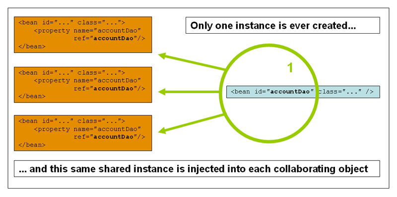
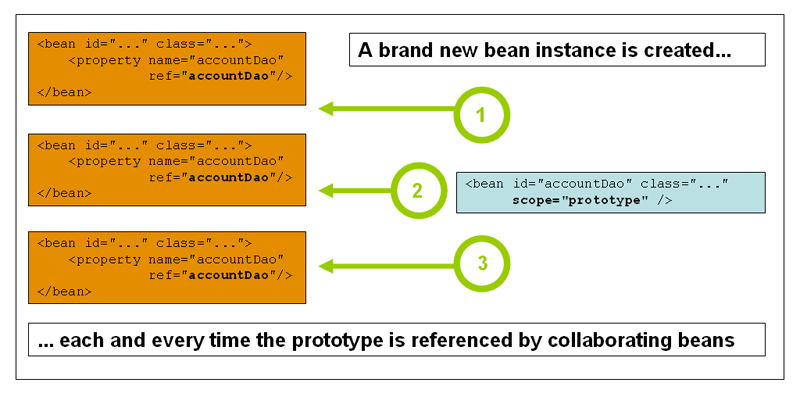

Bean scopes
====

当开发者定义Bean的时候，同时也会定义了该如何创建Bean实例。这些具体创建的过程是很重要的，因为只有通过对这些过程的配置，开发者才能创建实例对象。

开发者不仅可以控制注入不同的依赖到Bean之中，也可以配置Bean的作用域。这种方法是非常强大而且弹性也非常好的。开发者可以通过配置来指定对象的作用域，而不用在Java类层次上来配置。Bean可以配置多种作用域。
Spring框架支持5种作用域，有三种作用域是当开发者使用基于web的`ApplicationContext`的时候才生效的。

下面就是Spring直接支持的作用域了，当然开发者也可以自己定制作用域。

|作用域|描述|
|---------|--|
|单例(singleton)|（默认）每一个Spring IoC容器都拥有唯一的一个实例对象|
|原型（prototype）|一个Bean定义，任意多个对象|
|请求（request）|一个HTTP请求会产生一个Bean对象，也就是说，每一个HTTP请求都有自己的Bean实例。只在基于web的Spring `ApplicationContext`中可用|
|会话（session）|限定一个Bean的作用域为HTTP`session`的生命周期。同样，只有基于web的Spring `ApplicationContext`才能使用|
|全局会话（global session）|限定一个Bean的作用域为全局HTTP`Session`的生命周期。通常用于门户网站场景，同样，只有基于web的Spring `ApplicationContext`可用|
|应用(application)|限定一个Bean的作用域为`ServletContext`的生命周期。同样，只有基于web的Spring `ApplicationContext`可用|

> 在Spring 3.0中，*线程作用域*是可用的，但不是默认注册的。想了解更多的信息，可以参考本文后面关于`SimpleThreadScope`的文档。想要了解如何注册这个或者其他的自定义的作用域，可以参考后面的内容。

### The singleton scope

单例Bean全局只有一个共享的实例，所有将单例Bean作为依赖的情况下，容器返回将是同一个实例。

换言之，当开发者定义一个Bean的作用域为单例时，Spring IoC容器只会根据Bean定义来创建该Bean的唯一实例。这些唯一的实例会缓存到容器中，后续针对单例Bean的请求和引用，都会从这个缓存中拿到这个唯一的实例。



Spring的单例Bean和与设计模式之中的所定义的单例模式是有所区别的。设计模式中的单例模式是将一个对象的作用域硬编码的，一个ClassLoader只有唯一的一个实例。
而Spring的单例作用域，是基于每个容器，每个Bean只有一个实例。这意味着，如果开发者根据一个类定义了一个Bean在单个的Spring容器中，那么Spring容器会根据Bean定义创建一个唯一的Bean实例。
*单例作用域是Spring的默认作用域*，下面的例子是在基于XML的配置中配置单例模式的Bean。

```
<bean id="accountService" class="com.foo.DefaultAccountService"/>

<!-- the following is equivalent, though redundant (singleton scope is the default) -->
<bean id="accountService" class="com.foo.DefaultAccountService" scope="singleton"/>
```

### The prototype scope

非单例的，原型的Bean指的就是每次请求Bean实例的时候，返回的都是新实例的Bean对象。也就是说，每次注入到另外的Bean或者通过调用`getBean()`来获得的Bean都将是全新的实例。
这是基于线程安全性的考虑，如果使用有状态的Bean对象用原型作用域，而无状态的Bean对象用单例作用域。

下面的例子说明了Spring的原型作用域。DAO通常不会配置为原型对象，因为典型的DAO是不会有任何的状态的。



下面的例子展示了XML中如何定义一个原型的Bean：

```
<bean id="accountService" class="com.foo.DefaultAccountService" scope="prototype"/>
```

与其他的作用域相比，Spring是不会完全管理原型Bean的生命周期的：Spring容器只会初始化，配置以及装载这些Bean，传递给Client。但是之后就不会再去管原型Bean之后的动作了。
也就是说，初始化生命周期回调方法在所有作用域的Bean是都会调用的，但是销毁生命周期回调方法在原型Bean是不会调用的。所以，客户端代码必须注意清理原型Bean以及释放原型Bean所持有的一些资源。
可以通过使用自定义的`bean post-processor`来让Spring释放掉原型Bean所持有的资源。

在某些方面来说，Spring容器的角色就是取代了Java的`new`操作符，所有的生命周期的控制需要由客户端来处理。

### Singleton beans with prototype-bean dependencies

当使用单例Bean的时候，而该单例Bean的依赖是原型Bean的时候，需要注意的是*依赖的解析都是在初始化的阶段的*。因此，如果将原型Bean注入到单例的Bean之中，只会请求一次原型的Bean，然后注入到单例的Bean之中。这个依赖的原型Bean仍然属于只有一个实例的。

然而，假设你需要单例Bean对原型的Bean的依赖需要每次在运行时都请求一个新的实例，那么你就不能够将一个原型的Bean来注入到一个单例的Bean当中了，因为依赖注入只会进行*一次*。
当Spring容器在实例化单例Bean的时候，就会解析以及注入它所需的依赖。如果实在需要每次都请求一个新的实例，可以参考[Dependencies](Dependencies.md)中的**方法注入**部分。

### Request, session, global session, application, and WebSocket scopes

`request`,`session`以及`global session`这三个作用域都是只有在基于web的Spring`ApplicationContext`实现的（比如`XmlWebApplicationContext`）中才能使用。
如果开发者仅仅在常规的Spring IoC容器中比如`ClassPathXmlApplicationContext`中使用这些作用域，那么将会抛出一个`IllegalStateException`来说明使用了未知的作用域。

### Initial web configuration

为了能够使用`request`,`session`以及`global session`作用域（web范围的Bean）,需要在配置Bean之前配置做一些基础的配置。（对于标准的作用域，比如`singleton`以及`prototype`，是无需这些基础的配置的）

具体如何配置取决于Servlet的环境。

比如如果开发者使用了Spring Web MVC框架的话，每一个请求会通过Spring的`DispatcherServlet`或者`DispatcherPortlet`来处理的，也就没有其他特殊的初始化配置。`DispatcherServlet`和`DispatcherPortlet`已经包含了相关的状态。

如果使用Servlet 2.5的web容器，请求不是通过Spring的`DispatcherServlet`（比如JSF或者Struts）来处理。那么开发者需要注册`org.springframework.web.context.request.RequestContextListener`或者`ServletRequestListener`。
而在Servlet 3.0以后，这些都能够通过`WebApplicationInitializer`接口来实现。或者，如果是一些旧版本的容器的话，可以在`web.xml`中增加如下的Listener声明：

```
<web-app>
    ...
    <listener>
        <listener-class>
            org.springframework.web.context.request.RequestContextListener
        </listener-class>
    </listener>
    ...
</web-app>
```

如果是对Listener不甚熟悉，也可以考虑使用Spring的`RequestContextFilter`。Filter的映射取决于web应用的配置，开发者可以根据如下例子进行适当的修改。

```
<web-app>
    ...
    <filter>
        <filter-name>requestContextFilter</filter-name>
        <filter-class>org.springframework.web.filter.RequestContextFilter</filter-class>
    </filter>
    <filter-mapping>
        <filter-name>requestContextFilter</filter-name>
        <url-pattern>/*</url-pattern>
    </filter-mapping>
    ...
</web-app>
```

`DispatcherServlet`，`RequestContextListener`以及`RequestContextFilter`做的本质上完全一致，都是绑定request对象到服务请求的`Thread`上。这才使得Bean在之后的调用链上在请求和会话范围上可见。

### Request scope

参考如下的Bean定义

```
<bean id="loginAction" class="com.foo.LoginAction" scope="request"/>
```

Spring容器会在每次用到`loginAction`来处理每个HTTP请求的时候都会创建一个新的`LoginAction`实例。也就是说，`loginAction`Bean的作用域是HTTP`Request`级别的。
开发者可以随意改变实例的状态，因为其他通过`loginAction`请求来创建的实例根本看不到开发者改变的实例状态，所有创建的Bean实例都是根据独立的请求来的。当请求处理完毕，这个Bean也会销毁。

### Session scope

参考如下的Bean定义：

```
<bean id="userPreferences" class="com.foo.UserPreferences" scope="session"/>
```

Spring容器会在每次调用到`userPreferences`在一个单独的HTTP会话周期来创建一个新的`UserPreferences`实例。换言之，`userPreferences`Bean的作用域是HTTP`Session`级别的。
在`request-scoped`作用域的Bean上，开发者可以随意的更改实例的状态，同样，其他的HTTP`Session`基本的实例在每个Session都会请求`userPreferences`来创建新的实例，所以开发者更改Bean的状态，对于其他的Bean仍然是不可见的。当HTTP`Session`销毁了，那么根据这个`Session`来创建的Bean也就销毁了。

### Global session scope

> 该部分主要是描述`portlet`的，详情可以Google更多关于`portlet`的相关信息。

参考如下的Bean定义：

```
<bean id="userPreferences" class="com.foo.UserPreferences" scope="globalSession"/>
```

`global session`作用域比较类似之前提到的标准的HTTP`Session`，这种作用域是只应用于基于门户（portlet-based）的web应用的上下之中的。门户的Spec中定义的`global session`的意义：`global session`被所有构成门户的web应用所共享。定义为`global session`作用域的BEan是作用在全局门户`Session`的声明周期的。

如果在使用标准的基于Servlet的Web应用，而且定义了`global session`作用域的Bean，那么只是会使用标准的HTTP`Session`作用域，不会报错。

### Application scope

考虑如下的Bean定义：

```
<bean id="appPreferences" class="com.foo.AppPreferences" scope="application"/>
```

Spring容器会在整个web应用使用到`appPreferences`的时候创建一个新的`AppPreferences`的实例。也就是说，`appPreferences`Bean是在`ServletContext`级别的，好似一个普通的`ServletContext`属性一样。这种作用域在一些程度上来说和Spring的单例作用域是极为相似的，但是也有如下不同之处：

* `application`作用域是每个`ServletContext`中包含一个，而不是每个Spring`ApplicationContext`之中包含一个（某些应用中可能包含不止一个`ApplicationContext`）。
* `application`作用域仅仅作为`ServletContext`的属性可见，单例Bean是`ApplicationContext`可见。

### Scoped beans as dependencies

Spring IoC容器不仅仅管理对象（Bean）的实例化，同时也负责装载依赖。如果开发者想装载一个Bean到一个作用域更广的Bean当中去（比如HTTP请求返回的Bean）,那么开发者选择注入一个AOP代理而不是短作用域的Bean。也就是说，开发者需要注入一个代理对象，这个代理对象既可以找到实际的Bean，也能够创建一个全新的Bean。

> 开发者会在单例Bean中使用`<aop:scoped-proxy/>`标签，来引用一个代理，这个代理的作用就是用来获取指定的Bean。
当声明使用`<aop:scoped-proxy/>`来生成一个原型Bean的时候，每个通过代理的调用都会产生一个新的目标实例。
并且，作用域代理并不是唯一来获取短作用域Bean的唯一安全的方式。开发者也可以通过简单的声明注入为`ObjectFactory<MyTargetBean>，允许通过类似`getObject()`之类的调用来获取一些指定的依赖，而不是直接储存依赖的实例。
JSR-330关于这部分的名称不同叫做`Provider`，通过使用`Provider<MyTargetBean>声明和一个相关的`get()`方法来获取指定的依赖。详细关于[JSR-330](http://docs.spring.io/spring/docs/current/spring-framework-reference/htmlsingle/#beans-standard-annotations)的信息可以进去详细了解。

请参考下面的例子：

```
<?xml version="1.0" encoding="UTF-8"?>
<beans xmlns="http://www.springframework.org/schema/beans"
    xmlns:xsi="http://www.w3.org/2001/XMLSchema-instance"
    xmlns:aop="http://www.springframework.org/schema/aop"
    xsi:schemaLocation="http://www.springframework.org/schema/beans
        http://www.springframework.org/schema/beans/spring-beans.xsd
        http://www.springframework.org/schema/aop
        http://www.springframework.org/schema/aop/spring-aop.xsd">

    <!-- an HTTP Session-scoped bean exposed as a proxy -->
    <bean id="userPreferences" class="com.foo.UserPreferences" scope="session">
        <!-- instructs the container to proxy the surrounding bean -->
        <aop:scoped-proxy/>
    </bean>

    <!-- a singleton-scoped bean injected with a proxy to the above bean -->
    <bean id="userService" class="com.foo.SimpleUserService">
        <!-- a reference to the proxied userPreferences bean -->
        <property name="userPreferences" ref="userPreferences"/>
    </bean>
</beans>
```

使用代理，只需要在短作用域的Bean定义之中加入一个子节点`<aop:scoped-proxy/>`即可。[Dependencies](Dependencies.md)中的*方法注入*中就提及到了Bean依赖的一些问题，这也是我们为什么要使用`aop`代理的原因。假设我们没有使用`aop`代理而是直接进行依赖注入，参考如下的例子：

```
<bean id="userPreferences" class="com.foo.UserPreferences" scope="session"/>

<bean id="userManager" class="com.foo.UserManager">
    <property name="userPreferences" ref="userPreferences"/>
</bean>
```

上面的例子中，`userManager`明显是一个单例的Bean，注入了一个HTTP`Session`级别的`userPreferences`依赖，显然的问题就是`userManager`在Spring容器中只会实例化一次，而依赖(当前例子中的`userPreferences`)也只能注入一次。这也就意味着`userManager`每次使用的都是相同的`userPreferences`对象。

那么这种情况就绝对不是开发者想要的那种将短作用域注入到长作用域Bean中的情况了，举例来说，注入一个HTTP`Session`级别的Bean到一个单例之中，或者说，当开发者通过`userManager`来获取指定与某个HTTP`Session`的`userPreferences`对象都是不可能的。所以容器创建了一个获取`UserPreferences`对象的接口，这个接口可以根据Bean对象作用域机制来获取与作用域相关的对象（比如说HTTP`Request`或者HTTP`Session`等）。容器之后注入代理对象到`userManager`中，而意识不到所引用`UserPreferences`是代理。在这个例子之中，当`UserManager`实例调用方法来获取注入的依赖`UserPreferences`对象时，其实只会调用了代理的方法，由代理去获取真正的对象，在这个例子中就是HTTP`Session`级别的Bean。

所以当开发者希望能够正确的使用配置`request`,`session`或者`globalSession`级别的Bean来作为依赖时，需要进行如下的类似配置：

```
<bean id="userPreferences" class="com.foo.UserPreferences" scope="session">
    <aop:scoped-proxy/>
</bean>

<bean id="userManager" class="com.foo.UserManager">
    <property name="userPreferences" ref="userPreferences"/>
</bean>
```

**选择代理的类型**

默认情况下，Spring容器创建代理的时候标记为`<aop:scoped-proxy/>`的标签时，会创建一个*基于CGLIB的代理*。

> CGLIB代理会拦截`public`方法调用！所以不要在非`public`方法上使用代理，这样将不会获取到指定的依赖。

或者，开发者可以通过指`<aop:scoped-proxy/>`标签的`proxy-target-class`属性的值为`false`来配置Spring容器来为这些短作用域的Bean创建一个标准JDK的基于接口的代理。使用JDK基于接口的代理意味着开发者不需要在应用的路径引用额外的库来完成代理。当然，这也意味着短作用域的Bean需要额外实现一个接口，而依赖是从这些接口来获取的。

```
<!-- DefaultUserPreferences implements the UserPreferences interface -->
<bean id="userPreferences" class="com.foo.DefaultUserPreferences" scope="session">
    <aop:scoped-proxy proxy-target-class="false"/>
</bean>

<bean id="userManager" class="com.foo.UserManager">
    <property name="userPreferences" ref="userPreferences"/>
</bean>
```

`DefaultUserPreferences`实现了`UserPreferences`而且提供了接口来获取实际的对象。更多的信息可以参考[AOP代理](http://docs.spring.io/spring/docs/current/spring-framework-reference/htmlsingle/#aop-proxying)。

### Custom scopes

Bean的作用域机制是可扩展的，开发者可以定义自己的一些作用域，甚至重新定义已经存在的作用域，但是这一点Spring团队是不推荐的，并且开发者不能够重写`singleton`以及`prototype`作用域。

### Creating a custom scope

为了能够使Spring可以管理开发者定义的作用域，开发者需要实现`org.springframework.beans.factory.config.Scope`接口。想知道如何实现开发者自己定义的作用域，可以参考Spring框架的一些实现或者是`Scope`的javadoc，里面会解释开发者需要实现的一些细节。

`Scope`接口中含有4个方法来获取对象，移除对象，允许销毁等。

下面的方法返回一个存在的作用域的对象。比如说`Session`的作用域实现，该函数将返回会话作用域的Bean（如果Bean不存在，该方法会创建一个新的实例）

```
Object get(String name, ObjectFactory objectFactory)
```

下面的方法会将对象移出作用域。同样，以`Session`为例，该函数会删除`Session`作用域的Bean。删除的对象会作为返回值返回，当无法找到对象的时候可以返回`null`。

```
Object remove(String name)
```

下面的方法会注册一个回调方法，当需要销毁或者作用域销毁的时候调用。详细可以参考在javadoc和Spring作用域的实现中找到更多关于销毁回调方法的信息。

```
void registerDestructionCallback(String name, Runnable destructionCallback)
```

下面的方法会获取作用域的区分标识，区分标识区别于其他的作用域。

```
String getConversationId()
```


### Using a custom scope

在实现了开发者的自定义作用域之后，开发者还需要让Spring容器能够识别发现这个新的作用域。下面的方法就是在Spring容器中用来注册新的作用域的。

```
void registerScope(String scopeName, Scope scope);
```

这个方法是在`ConfigurableBeanFactory`的接口中声明的，在大多数的`ApplicationContext`的实现中都是可以用的，可以通过`BeanFactory`属性来调用。

`registerScope(..)`方法的第一个参数是作用域相关联的唯一的一个名字；举例来说，比如Spring容器之中的`singleton`和`prototype`就是这样的名字。第二个参数就是我们根据Scope接口所实现的具体的对象。

假定开发者实现了自定义的作用域，然后按照如下步骤来注册。

> 下面的例子使用了`SimpleThreadScope`，这个例子Spring中是有实现的，但是没有默认注册。开发者自实现的`Scope`也可以通过如下方式来注册。

```
Scope threadScope = new SimpleThreadScope();
beanFactory.registerScope("thread", threadScope);
```

之后，开发者可以通过如下类似的Bean定义来使用自定义的`Scope`:

```
<bean id="..." class="..." scope="thread">
```

在定制的`Scope`中，开发者也不限于仅仅通过编程方式来注册自己的`Scope`，开发者可以通过下面`CustomScopeConfigurer`类来实现：

```
<?xml version="1.0" encoding="UTF-8"?>
<beans xmlns="http://www.springframework.org/schema/beans"
    xmlns:xsi="http://www.w3.org/2001/XMLSchema-instance"
    xmlns:aop="http://www.springframework.org/schema/aop"
    xsi:schemaLocation="http://www.springframework.org/schema/beans
        http://www.springframework.org/schema/beans/spring-beans.xsd
        http://www.springframework.org/schema/aop
        http://www.springframework.org/schema/aop/spring-aop.xsd">

    <bean class="org.springframework.beans.factory.config.CustomScopeConfigurer">
        <property name="scopes">
            <map>
                <entry key="thread">
                    <bean class="org.springframework.context.support.SimpleThreadScope"/>
                </entry>
            </map>
        </property>
    </bean>

    <bean id="bar" class="x.y.Bar" scope="thread">
        <property name="name" value="Rick"/>
        <aop:scoped-proxy/>
    </bean>

    <bean id="foo" class="x.y.Foo">
        <property name="bar" ref="bar"/>
    </bean>

</beans>
```