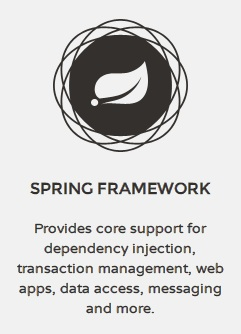

spring-framework-4-reference
============================

Chinese translation of [Spring Framework 4.x Reference Documentation] (http://docs.spring.io/spring/docs/current/spring-framework-reference/htmlsingle/).
The current version of Spring Framework 4.x is 4.3.0.RELEASE. There is also a GitBook version of the book: [http://waylau.gitbooks.io/spring-framework-4-reference](http://waylau.gitbooks.io/spring-framework-4-reference).
Let's [READ](SUMMARY.md)!

 
《Spring Framework 4.x参考文档》中文翻译（包含了官方文档以及其他文章）。至今为止，Spring Framework 的最新版本为 4.3.0.RELEASE。
 
利用业余时间对此进行翻译，并在原文的基础上，插入配图，图文并茂方便用户理解。如有勘误欢迎指正，[点此](https://github.com/waylau/spring-framework-4-reference/issues)提问。如有兴趣，也可以参与到本翻译工作中来 :)

### Get start 如何开始阅读

选择下面入口之一：

* <https://github.com/waylau/spring-framework-4-reference> 的 [SUMMARY.md](SUMMARY.md)（源码）
* <http://waylau.gitbooks.io/spring-framework-4-reference> 的 Read 按钮（同步更新，国内访问速度一般）

### Issue 意见、建议

如有勘误、意见或建议欢迎拍砖 <https://github.com/waylau/spring-framework-4-reference/issues>

### Contact 联系作者:

* Blog: [waylau.com](http://waylau.com)
* Gmail: [waylau521(at)gmail.com](mailto:waylau521@gmail.com)
* Weibo: [waylau521](http://weibo.com/waylau521)
* Twitter: [waylau521](https://twitter.com/waylau521)
* Github : [waylau](https://github.com/waylau)